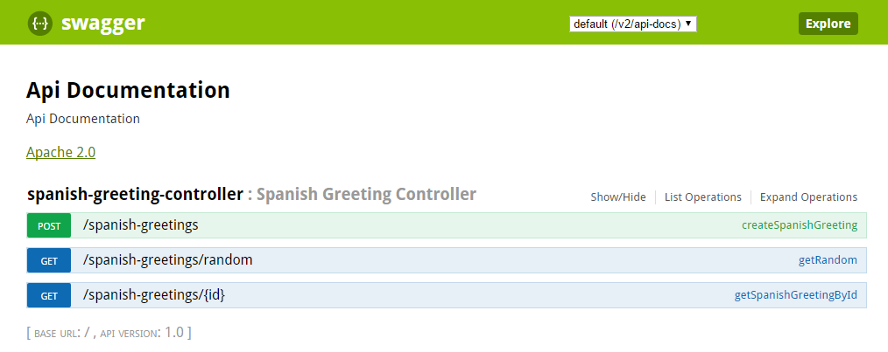

# Spring Boot @RestController Example

## Description

This project contains the sample code used in [The Practical Developer Blog](https://thepracticaldeveloper.com/2017/03/04/restcontroller-spring-boot-example-with-springfox-swagger/). It's a Spring Boot application with one plain Java object (`SpanishGreeting`) and a Spring Controller `SpanishGreetingController`.

The main goal of the project is to show how to write a `@RestController` in Spring Boot and include documentation with Swagger.
 
## How does it work?

You can use the endpoints behind `http://localhost:8080/spanish-greetings`. If you append `/random` to a `GET` request you'll receive a random Spanish greeting (which are actually hard-coded). You can also `GET` them by `id` (only from 1 to 3). To create a new one, you need to perform a `POST` operation.

Actually, much better if you just start the application and navigate to `http://localhost:8080/swagger-ui.html`. There you'll find a nice API documentation thanks to Swagger. Moreover, *you can play with it*.

